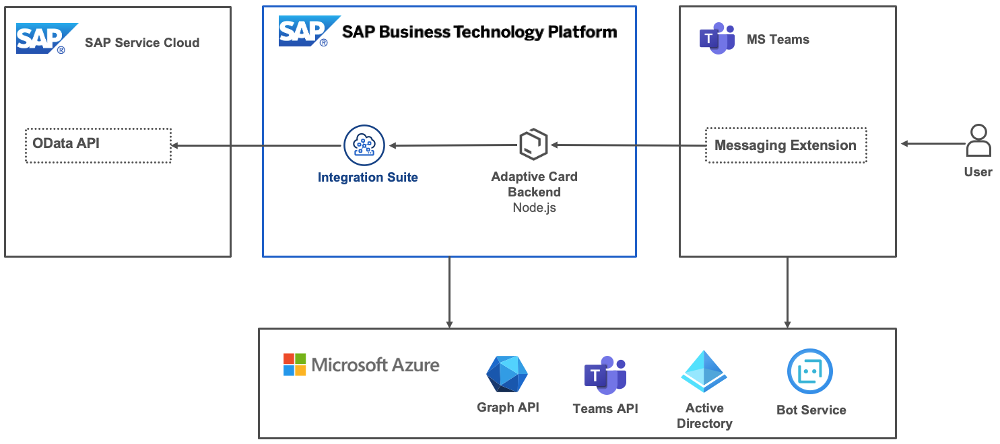

# **Integrate Microsoft Teams with SAP Service Cloud using SAP Integration Suite**

## Description

Integrate Microsoft Teams with SAP Service Cloud through SAP Integration Suite!

Ticket Collaboration messaging extension improves the productivity in ticket processing by seamlessly integrating SAP Service Cloud and Microsoft Teams. This messaging extension allows service agents to bring ticket information directly into MS Teams' conversations. The agents can add a brief description of the ticket as an adaptive card into the conversation to help their peers to understand the issue. After the discussion, the agents can export the conversation as a reference back to the ticket screen by using the Ticket Collaboration messaging extension. The extension simplifies SAP Service Cloud calls using the SAP Integration Suite.

## Architecture

## Challenges

Many issues handled by the members of SAP Service Cloud are complex and likely to require more than one session for the complete resolution. Agents often chat with their peers about complex issues, and multiple agents may also be involved in the process. It is challenging to keep track of the progress over various sessions and different agents, which may lead to delays in ticket resolution.

## Solution

The ticket collaboration messaging extension integrates Microsoft Teams with SAP Service Cloud using SAP integration suite and Business Technology Platform. Ticket collaboration extension augments the agents' conversation experience by enabling them to post ticket details into a chat. The extension also provides a convenient way to keep a reference to the current progress by allowing agents to export and attach a conversation into a service ticket.

## Requirements

- SAP Service Cloud C4C tenant.
- SAP integration suite on SAP BTP Subaccount.
- Application Server on SAP BTP subaccount, which support Teams messaging extension.
- Azure subscription.
- Microsoft 365 developer account.
- Microsoft Teams desktop application.

## Download and Installation

- Step 1: [Prerequisites for getting started with Teams Messaging Extensions.](./documentation/step1/prerequisites.md)

- Step 2: [Create Bot resource on Azure and setup SSO.](./documentation/step2/botsso.md)

- Step 2-1: [Create a sample ticket on your Cloud for Customer(C4C) tenant.](./documentation/step2-1/c4ctenant.md)

- Step 2-2: [Set up an SAP Cloud Integration Suite trial account.](./documentation/step2-2/cloud-integration-suite.md)

- Step 2-3: [Create Cloud Integration artifacts.](./documentation/step2-3/create-cloud-integration-artifacts.md)

- Step 2-4: [Update the Endpoints on the Backend Application.](./documentation/step2-4/update-the-endpoints-on-the-backend-application.md)

- Step 3: [Setup Ticket Collaboration Bot application and establish a secure HTTP tunnel.](./documentation/step3/setupcode.md)

- Step 4: [Register Ticket Collaboration application package in MS Teams AppStore.](./documentation/step4/registerapp.md)

- Step 5: [Deploy to the SAP BTP production environment.](./documentation/step5/deploy-to-the-production.md)

## Limitations

This example contains no known limitations.

## Known Issues

This example contains no known issues.

## How to obtain support

This project is provided "as-is" with no expectation for major changes or support.

[Create an issue](https://github.com/issues) in this repository if you find a bug or have questions about the content.

For additional support, [ask a question in SAP Community](https://answers.sap.com/questions/ask.html).

## Contributing
If you wish to contribute code, offer fixes or improvements, please send a pull request. Due to legal reasons, contributors will be asked to accept a DCO when they create the first pull request to this project. This happens in an automated fashion during the submission process. SAP uses [the standard DCO text of the Linux Foundation](https://developercertificate.org/).

## License

Copyright (c) 2022 SAP SE or an SAP affiliate company. All rights reserved. This project is licensed under the Apache Software License, version 2.0 except as noted otherwise in the [LICENSE](LICENSES/Apache-2.0.txt) file.
