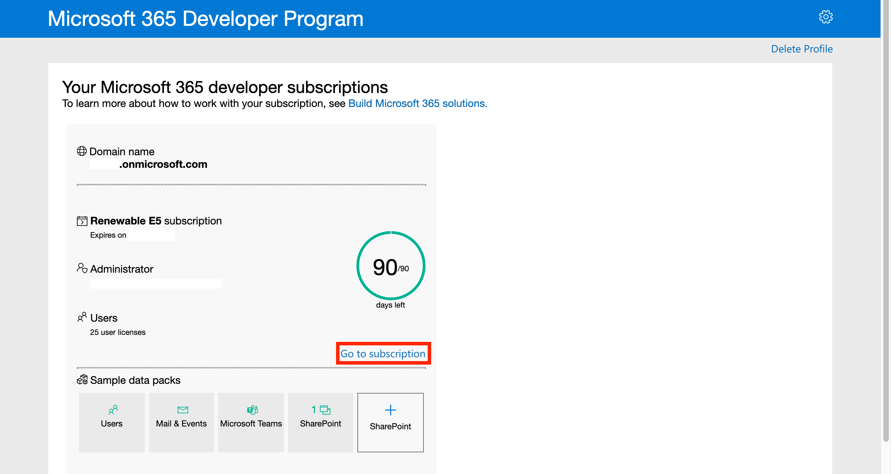

# **Pre-requisites for getting started with MS Teams Messaging Extensions**

Following dependencies are required for developing Chat Export Messaging Extension for MS Teams:

- [Node.js and Npm](#install-nodejs-and-npm).
- [Ngrok](#install-ngrok-tunneling) (recommended) or equivalent tunneling solution.
- [Azure Subscription with Bot Services and Active Directory privileges](#signup-for-an-azure-free-trial-subscription).
- [Microsoft 365 Developer Account with custom app uploading policy](#create-a-microsoft-365-developer-account).
- [A code editor](#install-a-code-editor).

\*\* If you already have all of these dependencies covered, please feel free to skip this section.

&nbsp;

## Install Node.js and npm

Download and install [Node.js](https://nodejs.org/en/download/) based on your operating system.

- You can check the Node.js installation using `node -v` command in your terminal.
- You can check the [npm](https://docs.npmjs.com/downloading-and-installing-node-js-and-npm) version using `npm -v` command in your terminal.

&nbsp;

## Install ngrok tunneling

Download and install [ngrok](https://ngrok.com/download) tunneling solution based on your operating system.

- You can check ngrok installation using `ngrok` command in your terminal.

&nbsp;

## Signup for an Azure free trial subscription

Setup an Azure free trial subscription by clicking on "Start freee" button and providig required details [here.](https://azure.microsoft.com/en-us/free/)

- After successful setup, you can see the Azure portal landing page as follows.
  

You can verify the access to Azure Bot Services and app registrations in Azure Active Directory.

- Azure Bot Services.
  

- Azure Active Directory.
  

&nbsp;

Note: If you are using an existing Azure subscrition, please verify if you have access to Bot Services and Azure Active Directory.

&nbsp;

## Create a Microsoft 365 Developer account

Create a free Microsoft M365 developer trial account following instructions in this [guide](https://docs.microsoft.com/en-us/office/developer-program/microsoft-365-developer-program).

1. Click on Join Now button.

   

2. Enter your email and password, and provide required details in the next few steps.

3. After entering required details, you can see a prompt to setup Microsoft 365 E5 sandbox (or open the prompt using "Set up E5 subscription" button). Select "Instant sandbox" and click on "Next" button.

   

4. Create an admin username and password. Click on "Continue" button and enter a phone number for security in the next step.

   

5. Once all the steps are completed, you can see the E5 subscription dashboard as follows. You can view the subscription by clicking on "Go to subscription".

   

6. After setting up E5 sandbox, you can visit [Microsoft 365 Admin Center](https://admin.microsoft.com/#/homepage), and goto "Teams Admin Center" from the side menu.

   

   

7. In the Teams Admin Center, you can verify that the custom app uploading is allowed.

   

&nbsp;

## Install a code editor

Download and install [Visual Studio Code](https://code.visualstudio.com/download) (recommended) depending upon your operating system.
