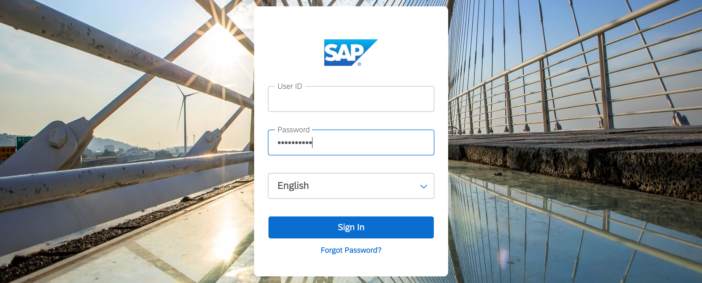
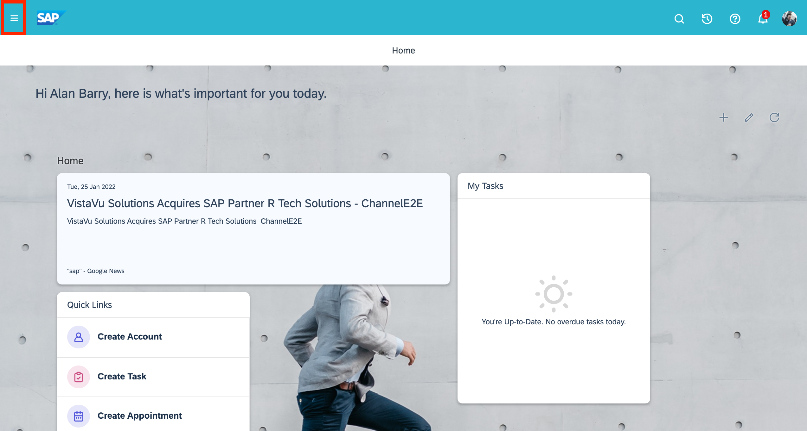
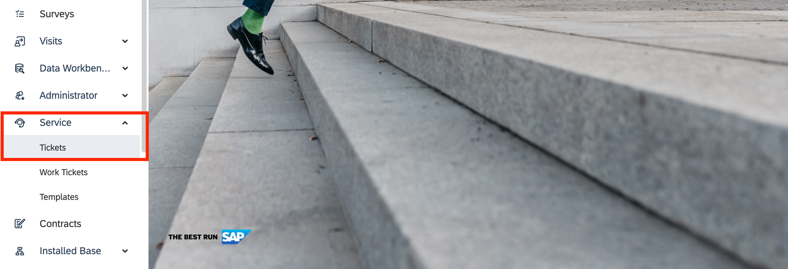
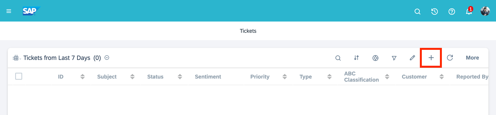
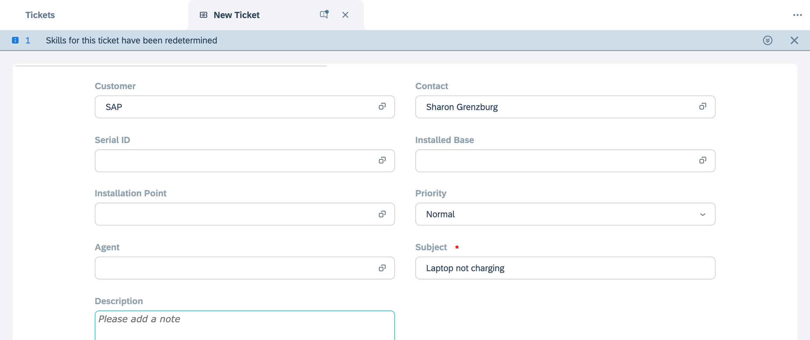
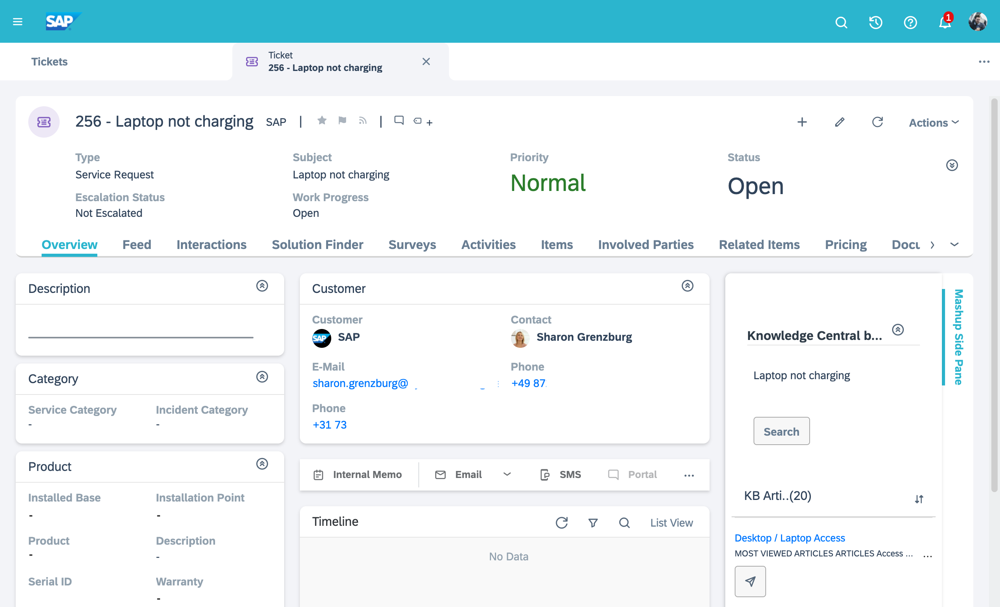

# **Create a sample ticket on your Cloud for Customer(C4C) tenant**

1. Once your request is approved and a demo tenant is assigned to you, login to the SAP Service Cloud C4C tenant using the link and the credentials provided in the email.
   

2. For the first time login you may be asked to change the password. Follow the on-screen instructions and setup your account.

3. Once the account is setup, you can see the landing page as below. Click on the hamburger menu located at the top-left corner.
   

4. In the menu, look for "Service", and select "Tickets" from the sub-menu.
   

5. After selecting "Tickets" you can see a list of existing tickets (if any). To create a new ticket, click on "+" icon located at the header.
   

6. Give some sample data to create a ticket. Only subject field is mandatory. After entering sample data, click on "Save and Open" button located at the bottom.
   
   

7. Once the ticket is created, you will be taken to the ticket screen where you can find all the details related to a service ticket.
   

8. The newly created ticket can also be found in the list of tickets under the current user.
   
