# Create Cloud Integration artifacts

- [Create a design package](#create-a-design-package).
- [Create Integration Flow(iFlow)](#create-integration-flowiflow).

## Create a design package

- Go to the Cloud Integration Suite application from your SAP BTP Cockpit
  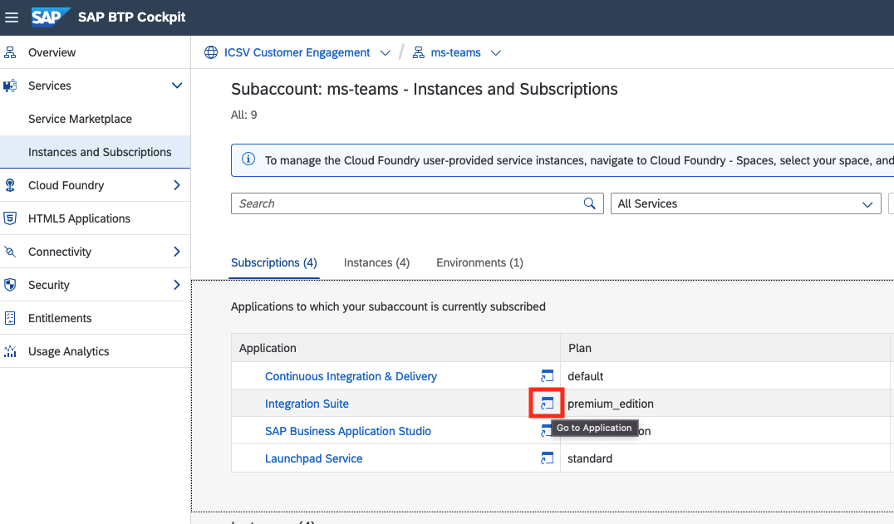
- Add Capabilities
  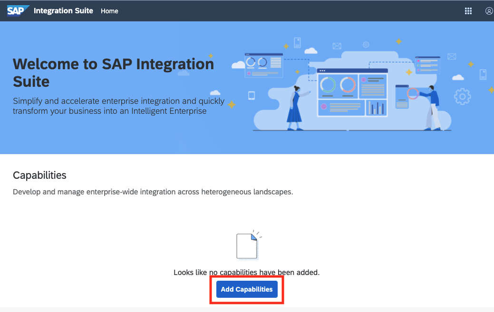
- Select "Design, Develop and Operate Integration Scenarios" and activate it
  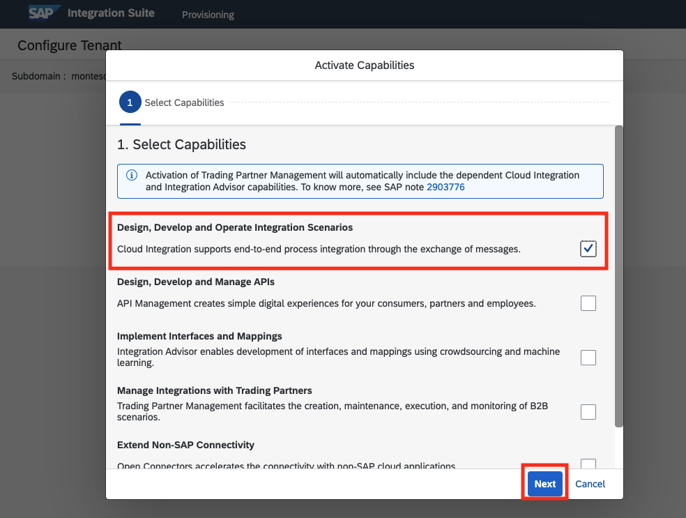
  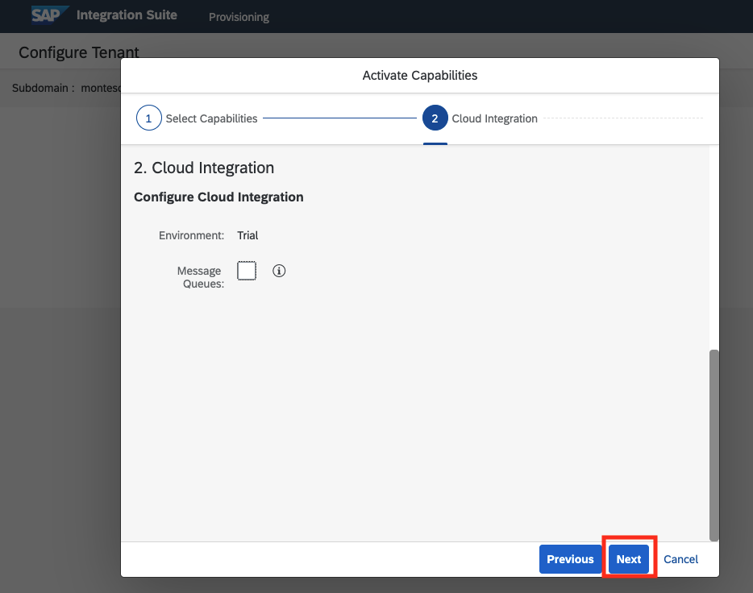
  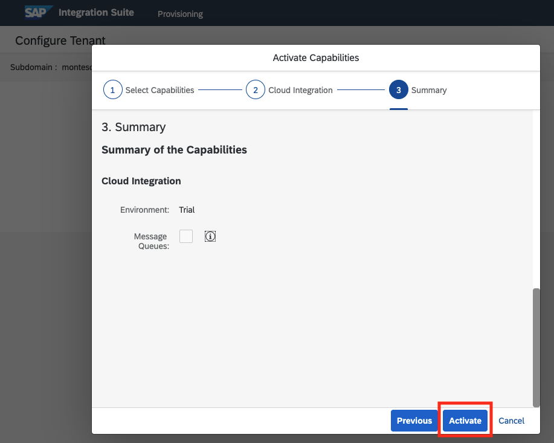
  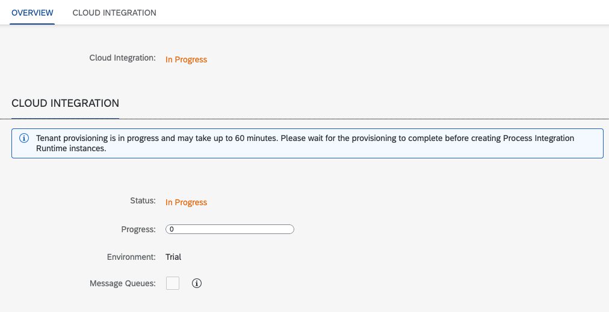
  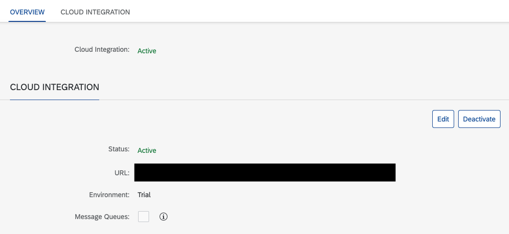
- Go back to home > Capabilities > Click "Design, Develop and Operate Integration Scenarios"
  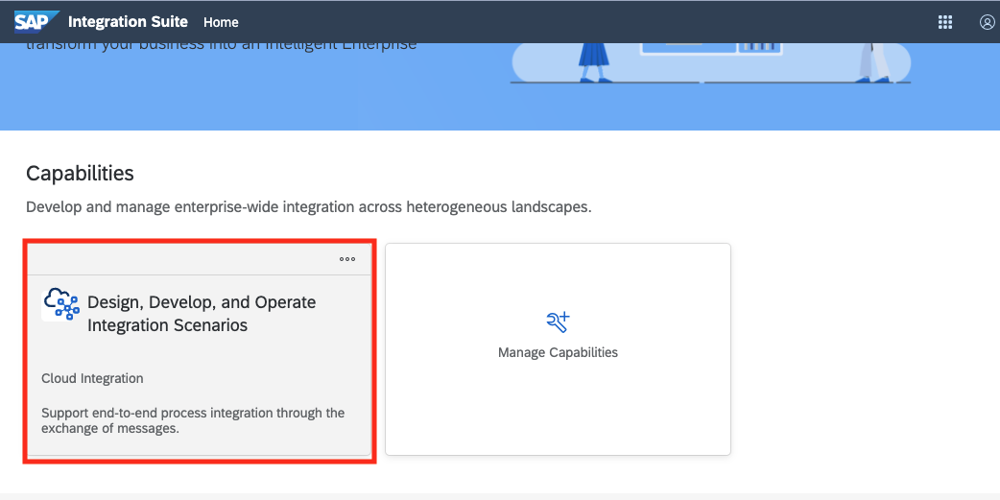
- Click "Design" menu on the left side
  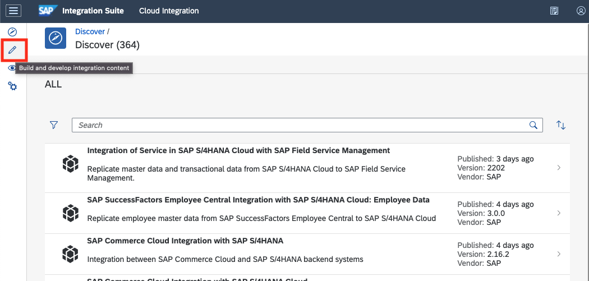
- Create a package and save it
  - Name: Teams Integration
  - Technical Name: (auto filled)
  - Short Description: Teams Integration description
    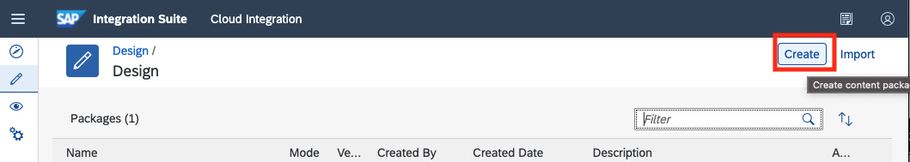
    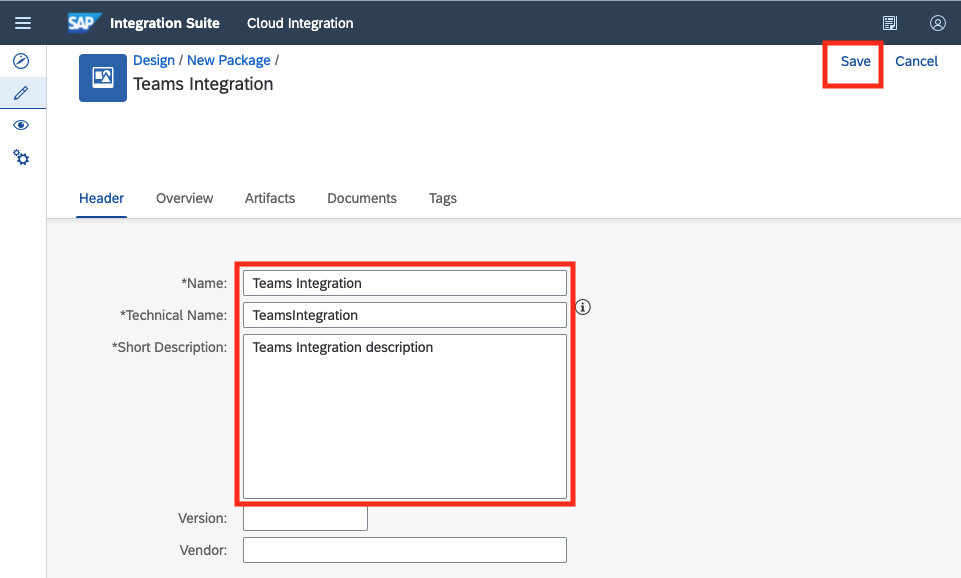

## Create Integration Flow(iFlow)

- Go to the package "Teams Integration"
- Go to "Artifacts"
- Click "Edit" on the top menu
  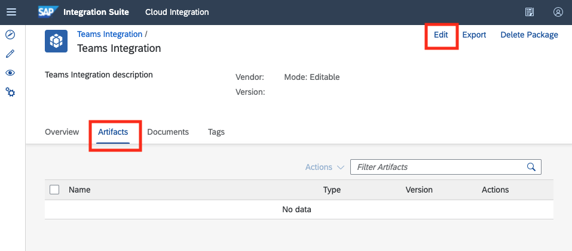
- Click "Add" > "Integration Flow"
  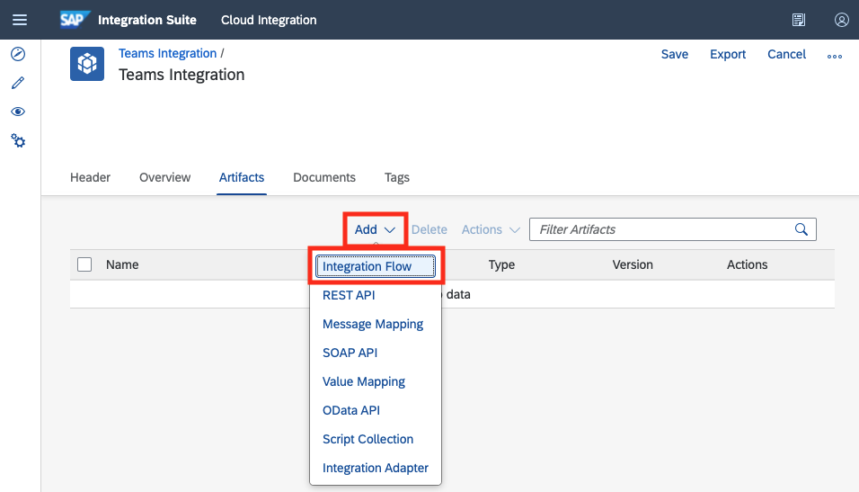
  1. Add [Get Employee Identity UUID by Email](./step2-3-1/get-employee-identity-uuid-by-email.md)
  2. Add [Get Tickets by Creation Identity UUID](./step2-3-2/get-tickets-by-creation-identity-uuid.md)
  3. Add [Get Ticket Info](./step2-3-3/get-ticket-info.md)
  4. Add [Post Ticket TextCollection](./step2-3-4/post-ticket-textcollection.md)
