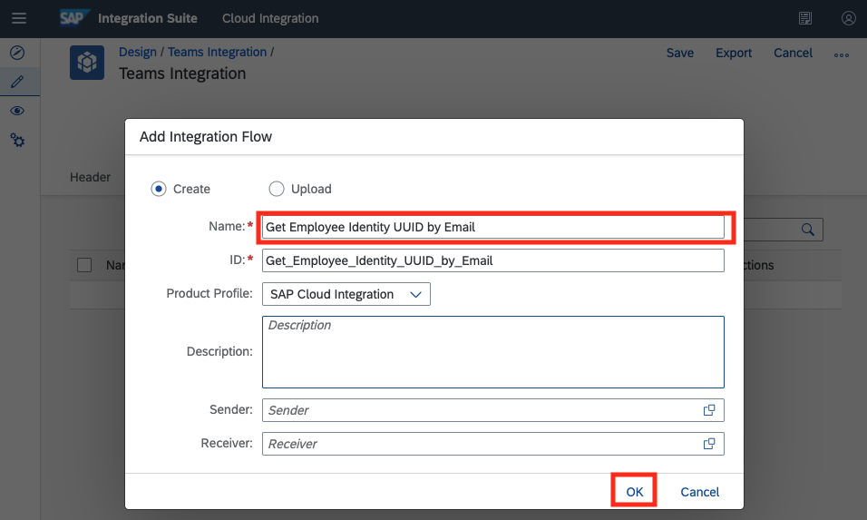
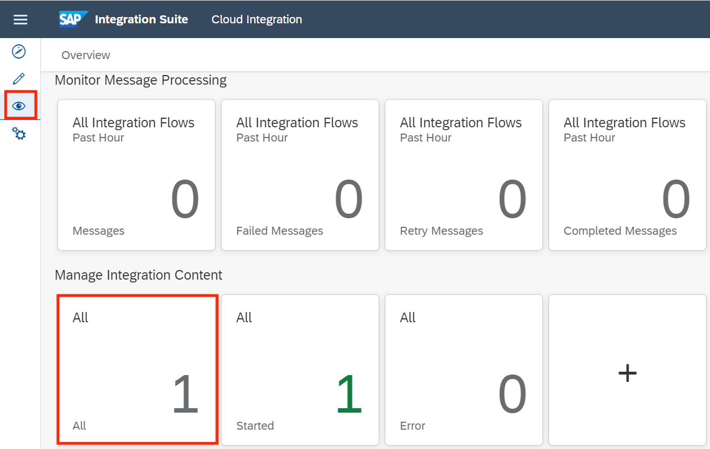

# Get Employee Identity UUID by Email
* Add "Integration Flow" and go into it
  * Name: Get Employee Identity UUID by Email
  * ID: (auto filled)
  
  
* Click "Edit" on the top menu
  
* Connect "HTTPS" from "Sender" to "Start"
  * "Connection" tab
    * Address: ```/EmployeeIdentityUuidByEmail```
    * CSRF Protected: unchecked
    
    
* Add "JSON to XML Converter" between "Start" and "End"
  
  
  
  
* Add "Content Modifier" between "JSON to XML Converter" and "End"
  * "Message Header" tab
    * Create, ```X-CSRF-Token```, Constant, ```Fetch```
    * Create, ```Authorization```, XPath, ```//authBasic```, ```java.lang.String```
    * Create, ```filter```, XPath, ```//filter```, ```java.lang.String```
    
    
    
* Add "Request Reply" between "Content Modifier" and "End"
* Connect "HTTP" from "Request Reply" to "Receiver"
  * "Connection" tab
    * Address: ```https://<TENANT_ID>.crm.ondemand.com/sap/c4c/odata/uid/v1/c4codataapi/EmployeeCollection```
    * Query: ```$format=json&$top=1&$filter=${header.filter}```
    * Method: GET
    * Authentication: None
    * Request Headers: ```*```
    * Response Headers: ```*```
    
    
    
    
    
    
* Click "Save"
* Click "Deploy"
  
* Go to "Monitor"
* Go to "Manage Integration Content" > "All"
* Check that the artifact is started successfully
  
  