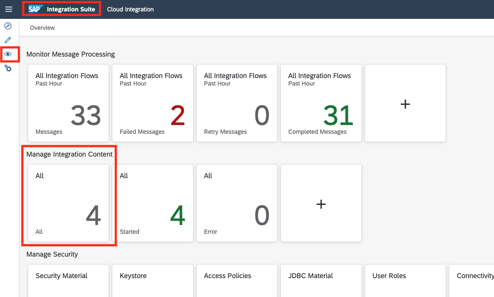
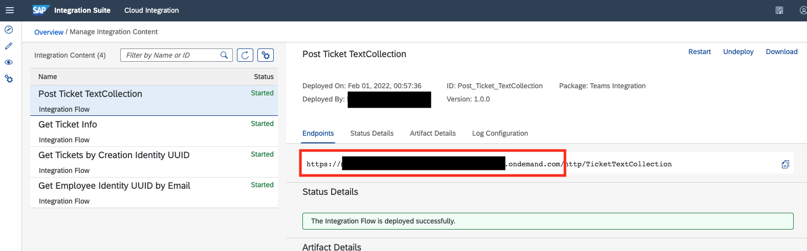
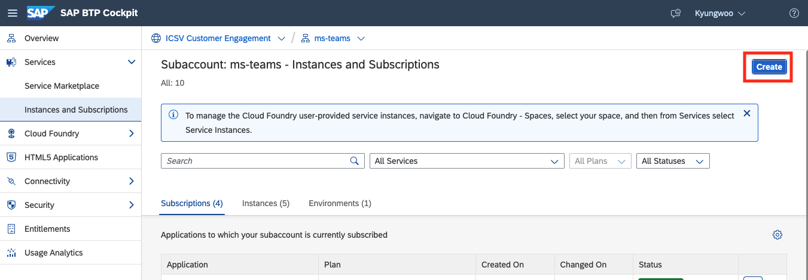
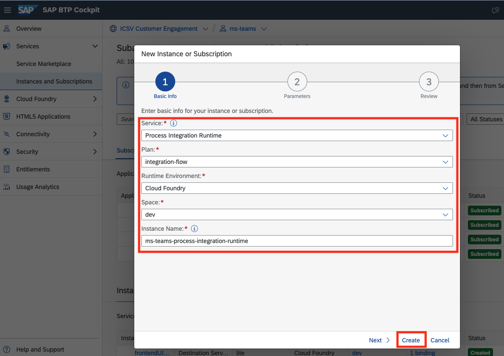
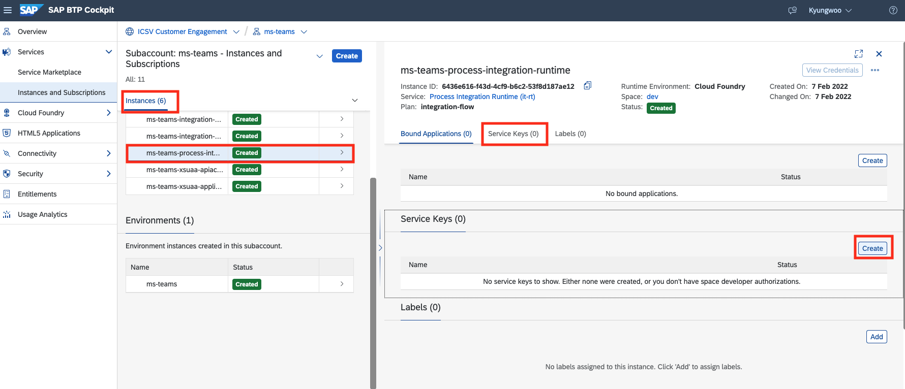
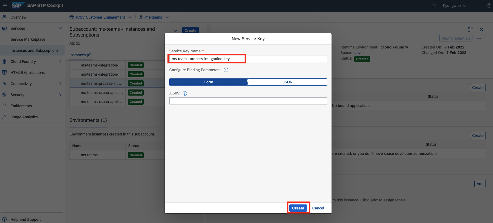
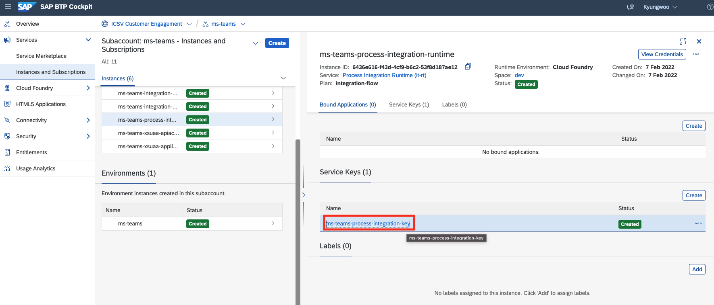
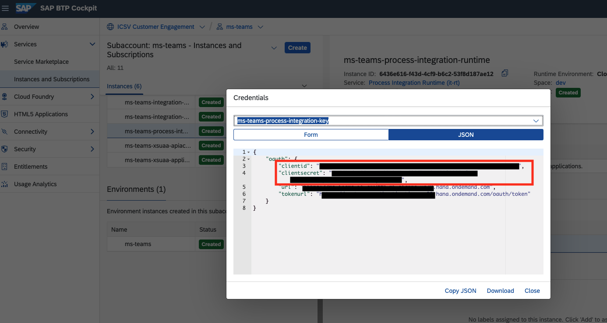

# Update the endpoints on the backend application
* Get <SAP_BTP_INTEGRATION_SUITE_ENDPOINT>
  * Go to the SAP Integration Suite
  * Go to the Monitor tab
  * Go to the Manage Integration Contents
  
  * Select one of Integration Contents
  * Copy the endpoint url except the "http/..." part
  * Save as <SAP_BTP_INTEGRATION_SUITE_ENDPOINT>
  
* Get <SAP_BTP_PROCESS_INTEGRATION_RUNTIME_...>
  * Go to the SAP BTP Cockpit
  * Go to the Services > Instances and Subscriptions
  
  * Create an instance
    * Service: Process Integration Runtime
    * Plan: integration-flow
    * Runtime Environment: Cloud Foundry
    * Space: <YOUR_SPACE>
    * Instance Name: ms-teams-integration-runtime (or any name you want)
  
  * After created, click the created instance
  * Go to the Service Keys
  * Create a key
  
  * Service Key Name: ms-teams-process-integration-key (or any name you want)
  
  * After created, click the created service key
  
  * Save the key information
    * "clientid" as <SAP_BTP_PROCESS_INTEGRATION_RUNTIME_CLIENT_ID>
    * "clientsecret" as <SAP_BTP_PROCESS_INTEGRATION_RUNTIME_CLIENT_SECRET>
  
* update /backend/.env
```
# SAP Integration flow
iFlowUrl=<SAP_BTP_INTEGRATION_SUITE_ENDPOINT>
iFlowClientId=<SAP_BTP_PROCESS_INTEGRATION_RUNTIME_CLIENT_ID>
iFlowClientSecret=<SAP_BTP_PROCESS_INTEGRATION_RUNTIME_CLIENT_SECRET>
```
