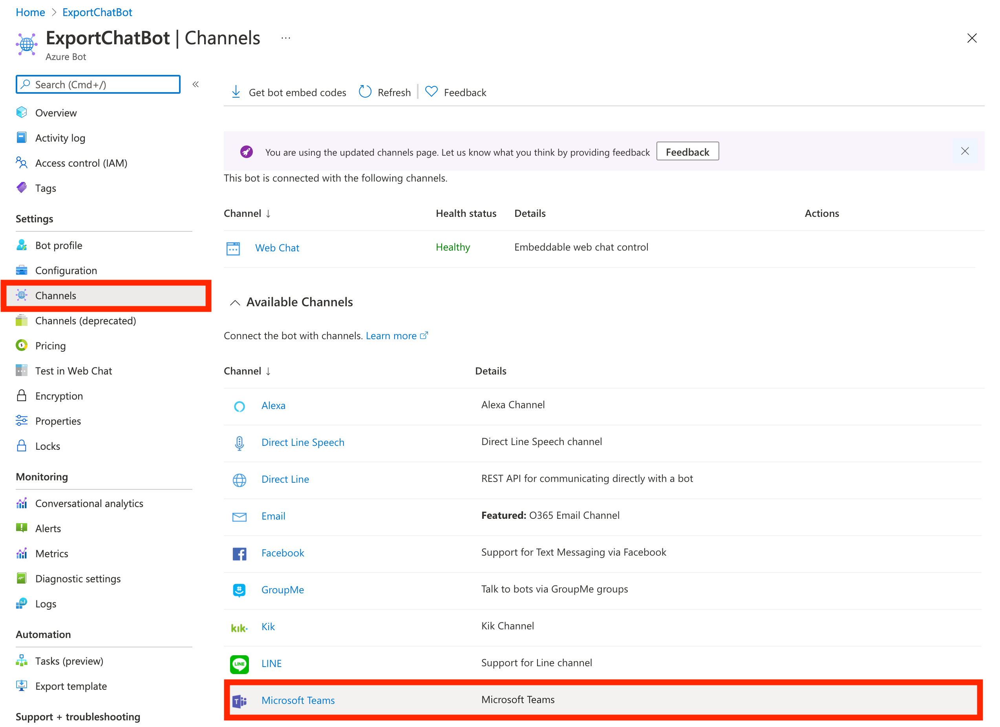
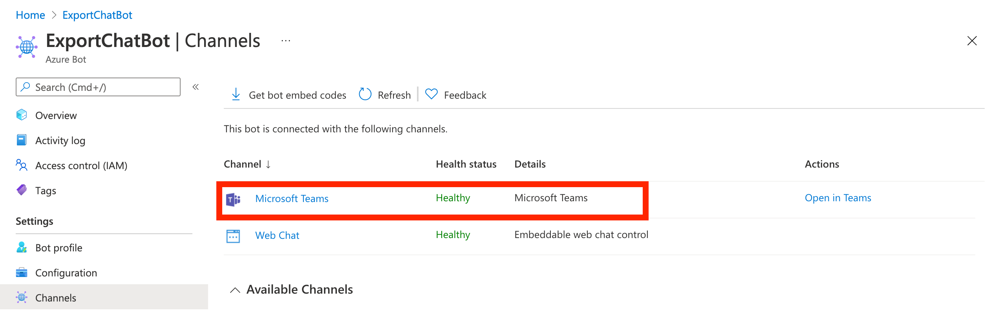
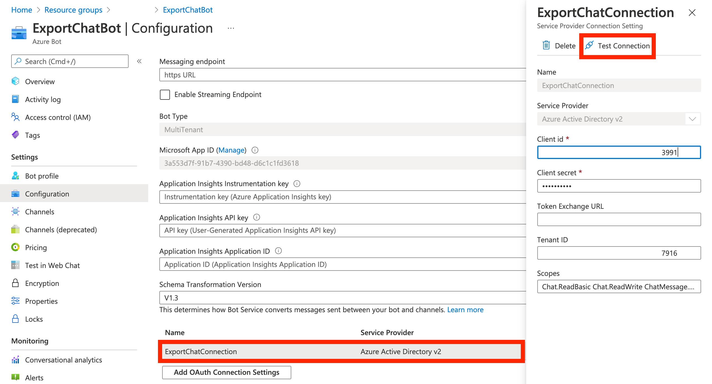

# **Create Bot resource on Azure and setup SSO (Single Sign On)**

Following steps are involved in the creation of a Bot resource on Azure, and setting up its SSO:

- [Create Azure Bot Resource and connect it to Teams](#create-azure-bot-resource-and-connect-it-to-teams).
- [Create Azure Active Directory Identity Provider](#create-azure-active-directory-identity-provider).
- [Register Azure Active Directory Identity Provider with the Bot](#register-azure-active-directory-identity-provider-with-the-bot).

&nbsp;

## Create Azure Bot Resource and connect it to Teams

1. Goto [Azure Portal](https://portal.azure.com/) (signin to the azure subscription created in [prerequisite step](../step1/prerequisites.md#signup-for-an-azure-free-trial-subscription)) and click on "Create a resource".
   

2. Search for "bot" in the search bar, and select `Azure Bot`. Click on "Create".
   
   

&nbsp;

3. Give an appropriate name for your bot (bot handle). Create a new resource group for the bot (by clicking on "Create new"), or use an existing resource group. Set "Type of App" to `Multi Tenant`. Click on "Review + create". In the next prompt, click on "Create".
   

4. Go to newly created bot resource by clicking on "Go to resource".
   

5. Connect the bot to Teams by adding "Microsoft Teams" channel to the bot in the "Channels" section.

   - Select "Microsoft Teams" from the list of available channels.
   - Keep everything to default and click on "Save".
   - Confirm that the "Microsoft Teams" channel is successfully added to the bot.

   
   

- Note: Creation of Multi Tenant Azure Bot resource also creates an app registration in Azure AD. You can view it in the Azure AD app registrations.
  

&nbsp;

## Create Azure Active Directory Identity Provider

1. Create a new Azure AD Identitity provider for the bot resource created in the above step, by clicking on "New registration" in Azure AD app registrations (Home > Azure Active Directory > App Registrations).
   

2. Give an appropriate name for the app, and set "Redirect URI" to `https://token.botframework.com/.auth/web/redirect`. Click on "Register".
   

3. Note down "Application ID" and "Tenant ID", found in the "Overview" section of the app. These values are required to setup OAuth Connection in Bot.
   

4. Create a "Client Secret" by clicking on "New client secret" in the "Certificates & secrets" section of the app. Set the validity to maximum available value and click on "Save". Note down the "Value" of newly created client secret.
   
   

   - Note: You can re-create the client secret any time.

5. Add API premissions to the identity provider by clicking on "Add permission" in "API Permissions" section. Select "Microsoft Graph".
   

   5.1. Add the following delegated permissions by selecting "delegated permissions" card. You can use the search bar to find required permissions.

   ```
    Chat.ReadBasic
    Chat.ReadWrite
    ChatMessage.Read
    ChatMessage.Send
    openid
    profile
    User.Read
   ```

   

   5.2. Grant Admin consent for these API permissions by clicking on "Grant admin consent for ...". Note down the added permissions to set up bot OAuth connection later.
   

&nbsp;

## Register Azure Active Directory Identity Provider with the Bot

1. Go to the previously created Bot resource (Home > Resource Groups > [Your Resource Grpoup] > [Your Bot]).

   - Ex: Home > Resource Groups > Teams > ExportChatBot

2. Add a new OAuth connection settings by clicking on "Add OAuth Connection Settings" button under "Configuration" section.

   - 2.1. Give an appropriate name to the connection.
   - 2.2. Set Service Provider to `Azure Active Directory v2`.
   - 2.3. Set Client ID to App ID (previously noted) of the Identity Provider.
   - 2.4. Leave Token Exchange URL blank.
   - 2.5. Set Tenant ID to the Tenant ID (previously noted) of the Identity Provider.
   - 2.6. Set Scopes to a space separated list of API Permissions which were added to the Identity Provider.
     - Ex: `Chat.ReadBasic Chat.ReadWrite ChatMessage.Read ChatMessage.Send openid profile User.Read`

   

3. Test the connection by clicking on "Test Connection" under newly created OAuth connection settings.

   
   

4. Note down the connection name (name given in 2.1) for setting up the bot application later.
