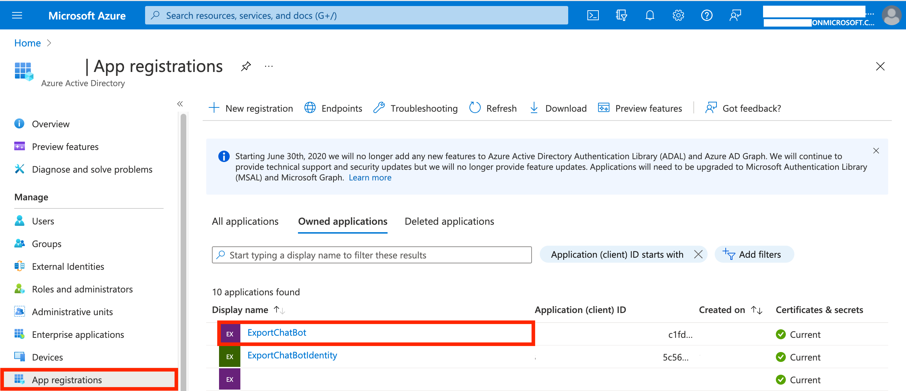
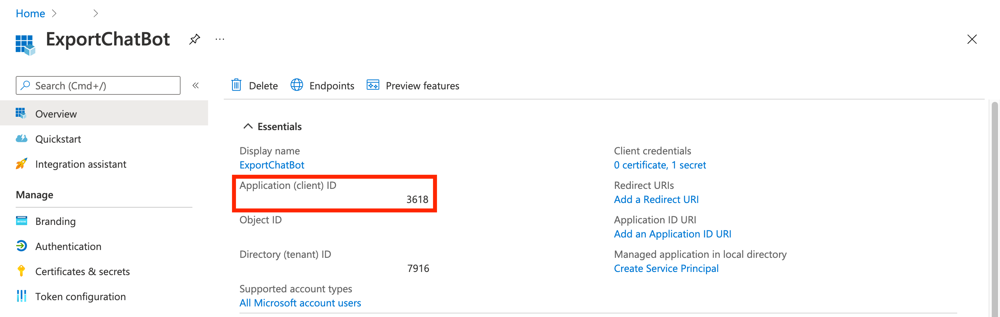
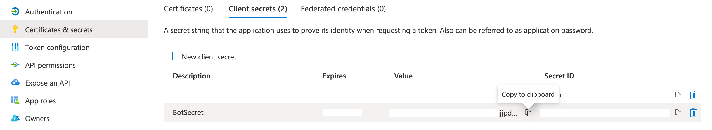
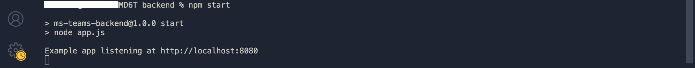
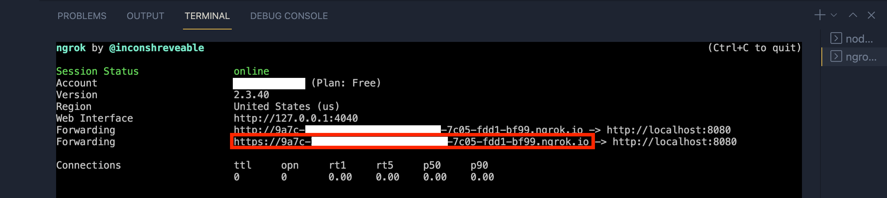
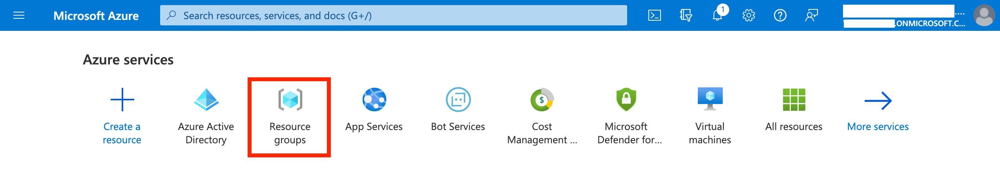
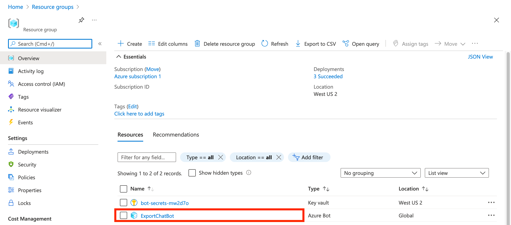
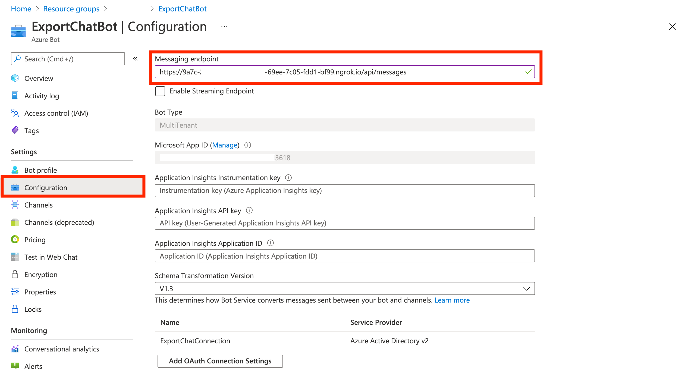

# **Setup Ticket Collaboration Bot application and establish a secure HTTP tunnel**

Following steps are involved in setting up Teams Messaging Extension application locally and securely tunnel it:

- [Get AppID and AppPassword of the Bot application from Azure AD](#get-appid-and-apppassword-of-the-bot-application-from-azure-ad).
- [Get Ticket Collaboration messaging extension](#get-ticket-collaboration-messaging-extension).
- [Update Environment Variables](#update-environment-variables).
- [Run Node.js bot application](#run-nodejs-bot-application).
- [Establish a secure HTTP tunnel using Ngrok](#establish-a-secure-http-tunnel-using-ngrok).
- [Update Messaging Endpoint](#update-messaging-endpoint).

&nbsp;

## Get AppID and AppPassword of the Bot application from Azure AD

1. Go to [Azure Portal](https://portal.azure.com/#home).
2. Navigate to Azure AD and select "App Registrations" from the side menu.
3. Open the the Azure AD application which was created along with the creation of [Multi Tenant Bot resource](../step2/botsso.md#create-azure-bot-resource) (Ex: `ExportChatBot`).
   
4. Note down the `Application (client) ID` from the "Overview" section.
   

5. Create a new "Client Secret" by clicking on "New client secret" in the "Certificates & secrets" section of the app. Set the validity to maximum available value and click on "Save". Note down the "Value" of newly created client secret.
   

&nbsp;

## Get Ticket Collaboration messaging extension

Get the Ticket Collaboration Node.js application from [GitHub](https://github.tools.sap/btp-use-case-factory/teams-c4c-ticket-collaboration).

- You can clone the repository into your computer or download the repository as a zip file.

&nbsp;

## Update Environment Variables

1.  Open the cloned/downloaded Ticket Collaboration messaging extension's code-base using [VS Code](../step1/prerequisites.md#install-a-code-editor).

2.  Navigate to `/backend` folder and open `.env` file.

    - 2.1. Update `MicrosoftAppId` with the AppID of the bot registration, obtained in the [previous section](#get-appid-and-apppassword-of-the-bot-application-from-azure-ad).
    - 2.2. Update `MicrosoftAppPassword` with the Client Secret of the bot registration, created in the [previous section](#get-appid-and-apppassword-of-the-bot-application-from-azure-ad).
    - 2.3. Update `connectionName` with the name of the OAuth Connection settings noted during [identity provider registration](../step2/botsso.md##register-azure-active-directory-identity-provider-with-the-bot) (step 4).

    ```
    # MS BOT app credentials
    MicrosoftAppId=<your-app-id>
    MicrosoftAppPassword=<your-app-secret>
    connectionName=<your-connection-name>
    ```

&nbsp;

## Run Node.js bot application

1. Open the embedded terminal in VS Code using `` Ctrl + `  ``.
2. Navigate to `/backend` folder from the root of the repository and install required dependencies using `npm install`.
3. Start the application using `npm start`.
   
   - Note: Server will start at the port 8080 by default if the port is free.

&nbsp;

## Establish a secure HTTP tunnel using Ngrok

1. Establish a secure HTTP tunnel for the locally running bot application using `ngrok http -host-header=rewrite 8080` in a new VS Code terminal.

   ```
   #Ngrok command

   ngrok http -host-header=rewrite <port-number>
   ```

   **Important:** Tunnel should be established at the same port where the Node.js bot application is listening to.

2. Copy HTTPS endpoint created for the application.
   
   **Important:** Messaging endpoing should be updated each time when you restart Ngrok. This is due to the change in domain name when you restart Ngrok tunneling (free version).

&nbsp;

## Update Messaging Endpoint

1. Go to [Azure Portal](https://portal.azure.com/#home) and click on "Resource Groups". Navigate to the resource group created for the Messaging Extension Bot.
   

2. Open the Messaging Extension Bot.
   

3. Navigate to "Configurations" page set messaging endpoint to `https://{{ngrok-domain}}/api/messages`.<br/>
   Ex: `https://xxxx-xxxx-xxxx-xxxx-xxx-xxxx.ngrok.io/api/messages`.
   
4. Click on "Apply" at the bottom of the page.

   Note: After deploying the application in the SAP Business Technology Platform, there is no need for Ngrok tunneling. Update the messaging endpoint with the BTP URL.
