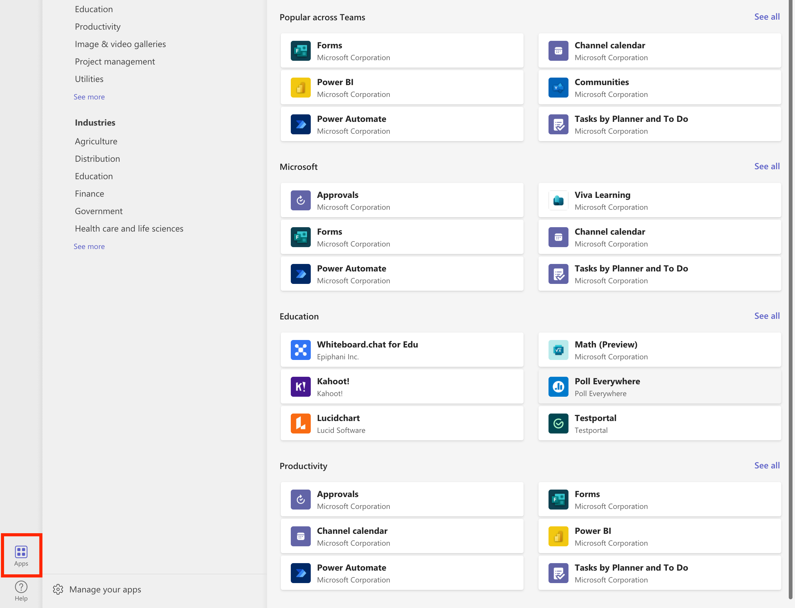
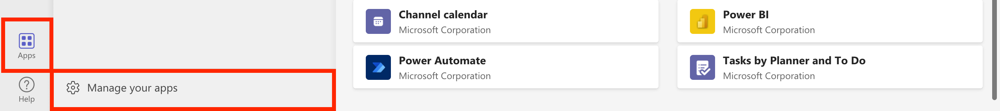
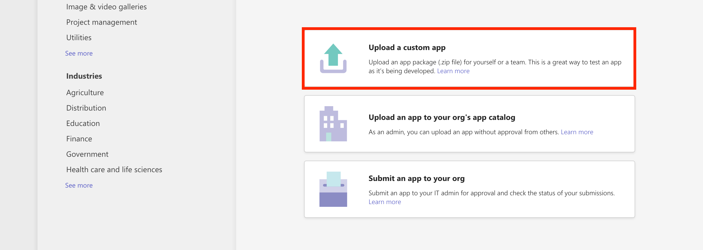
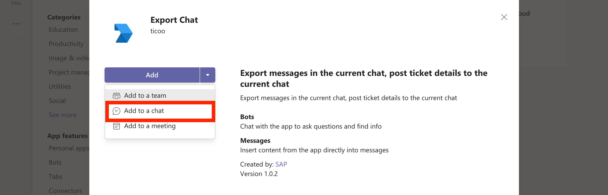
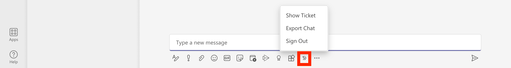
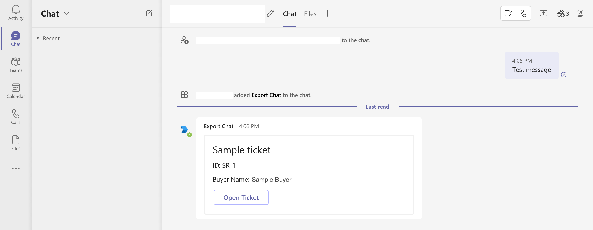
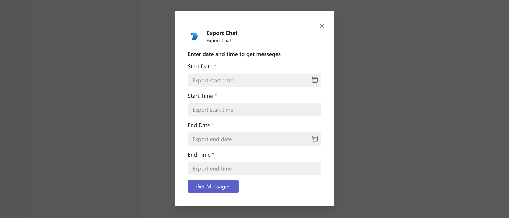
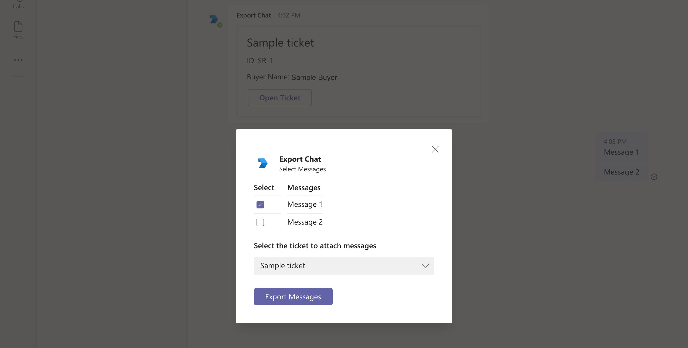
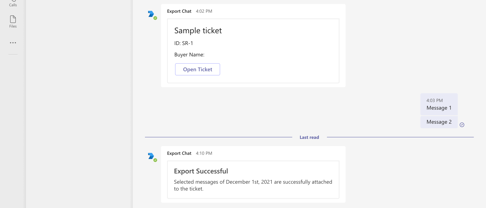

# **Register Ticket Collaboration application package in MS Teams AppStore**

Following steps are involved in the registration of Ticket Collaboration messaging extension to MS Teams App store:

- [Update and package app manifest](#update-and-package-app-manifest).
- [Upload app package to MS Teams app store](#upload-app-package-to-ms-teams-app-store).
- [Test Ticket Collaboration messaging extension](#test-ticket-collaboration-messaging-extension).

&nbsp;

## Update and package app manifest

1. Go to the Teams app manifest present at `/teams-app-package/manifest.json`.

2. Replace each of the placeholder `{TODO: MicrosoftAppId}` with the AppId of the Azure AD bot application, noted down in this [step](../step3/setupcode.md#get-appid-and-apppassword-of-the-bot-application-from-azure-ad).

3. After updating `manifest.json`, compress the contents of the folder `teams-app-package` using the given shell script as `sh compress-app.sh` by navigating to /teams-app-package folder.

   The compressed file contains `manifest.json`, `icon-color.png`, `icon-outline.png`. The app package is now ready to upload to Teams AppStore.

   Note:

   - You can create your own app manifest from [Microsoft Developer Portal](https://dev.teams.microsoft.com/home).
   - The compressed file must contain only `manifest.json`, `icon-color.png`, `icon-outline.png`.

&nbsp;

## Upload app package to MS Teams app store

1. Open MS Teams desktop application, and signin using the Microsoft 365 developer account created during the [prerequisite](../step1/prerequisites.md#create-a-microsoft-365-developer-account) step.

2. Open Teams AppStore located at the bottom left corner.
   

3. Click on "Manage your apps" and select "Upload a custom app" for testing before deployment.
   
   

   Note: After the deployment of the app in SAP BTP, you can use "Upload an app to your org's app catalog" option to publish the app to the app catalog.

4. Upload the app package (zip file) created in the above [step](#update-and-package-app-manifest).

5. After successful uploading, you can add the messaging extension to any one-on-one or group chat.

&nbsp;

## Test Ticket Collaboration messaging extension

1. Add "Ticket Collaboration" messaging extension to any one-on-one or group chat, from the app store.
   

2. After adding the bot to a conversation, you can view the actions suppported by the "Ticket Collaboration" messaging extension by clicing on the icon below the message composition area.
   

3. Add a ticket detail to the current chat by selecting "Show Ticket" option.

4. You will be asked to set up the bot (login) for the first time use. Use the same Micrsoft 365 developer account to setup the bot.
   

5. Select the ticket you want to add to the chat, and click on "Add" button. An adaptive card with brief ticket information will be added to the chat.
   
   

6. After a trial conversation, click on messaging extension again and select "Export Chat" option.

7. Enter start and end dates and times. You can enter the same start and end dates to get the messages of a particular day. Click on "Get Messages" to get all messages between the given dates.
   

8. Select the relavent messages you want to add to the attachment, and select the ticket to which you want to attach the conversation to. Click on "Ticket Collaboration" button to export and attach selected messages to the ticket.
   

9. The messaging extension adds an export confirmation message as an adaptive card in the chat.
   
