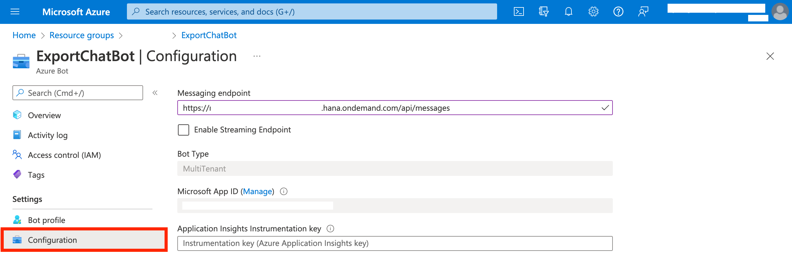
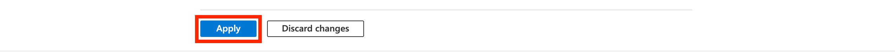

# Deploy to the SAP BTP production environment.

- Deploy the backend

```
cd backend
cf api <CF_API_ENDPOINT>
cf login
cf push
```

## Update the Ngrok tunnel to the SAP BTP application endpoint

Oncle the application is successfully deployed in SAP BTP environment, update the application endpoint in the Azure portal.

1. Go to [Azure portal](https://portal.azure.com), and login with your M365 developer account.

2. Locate the bot resource you created during the the [Bot creation step](https://github.wdf.sap.corp/SCE/ms-teams-usecase/blob/main/documentation/step2/botsso.md#create-azure-bot-resource-and-connect-it-to-teams), under "Resource Groups".

3. Find the "Configuration" option in the left side menu, and update the Ngrok Messaging endpoint with the BTP application endpoint as shown below.
   

4. Click on "Apply" button located at the bottom of the screen to save the updated endpoint.
   

The application deployment is now complete!
